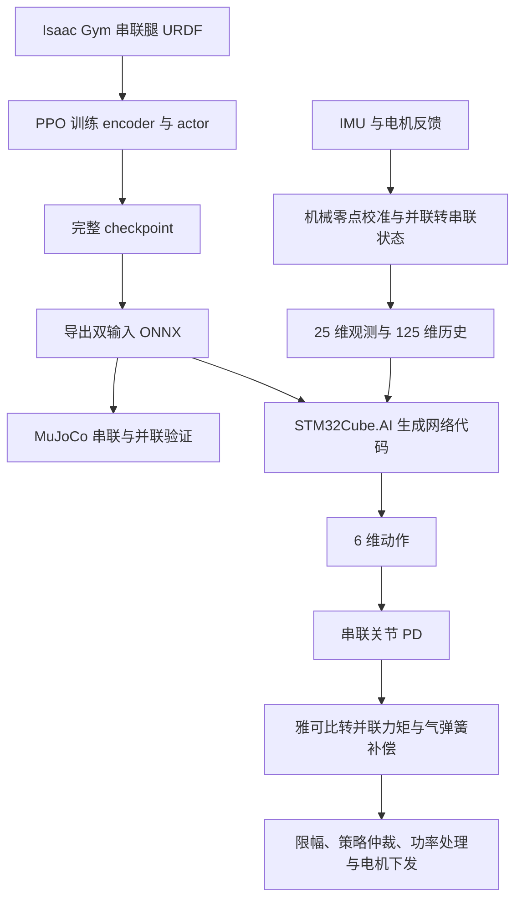

# 复旦轮足训练与实车部署对应分析

核对日期：2026-10-02。本文为外部项目源码与模型静态分析，不是本机 chuanliantui/H7 的部署接口或模型交付记录。

核对版本均为当日公开仓库默认 `main`：

- 训练：`yly-true/fudan_rl_wheel_leg`，`8204e853dfd2ed06d85a322e1a998c3d20a3be2c`。
- 部署：`chushanxiaodaoshi/XYEGA_RM2026_WheelLeg_Infatry_RLdeploy`，`fcfdd3959be5c9b00893ec0701a591ddbf55b830`。

结论：两仓属于同一条技术路线，部署 README 明确说明运动学来自训练仓的 sim2sim。但“控制接口对应”“参数配置对应”“模型权重相同”是三个不同判断：前两项可以逐项核对，公开附带的模型并非同一份权重。

## 1. 总体链路与源码入口



| 作用 | 训练／sim2sim | 部署 |
|---|---|---|
| 平地与地形运动 | `plane/wheel_legged_gym/` | Stable、MiniRecover/Upstairs、Spin/Pin 等模型及参数选择 |
| 跳跃训练 | `jump/wheel_legged_gym/` | Jump 模型，另加 TOF 触发、持续时间、落地后切换 |
| 构造策略观测 | `legged_robot.py::compute_proprioception_observations()` | `chassis.cpp::buildRLObservation()` |
| 历史堆叠 | `compute_observations()`、`reset_idx()` | `updateRLObservationHistory()`、`updatePolicy()` |
| encoder + actor | `rsl_rl/modules/actor_critic_sequence.py` | ONNX 转换后的 Cube.AI 网络，封装在 `rl_policy.cpp` |
| 导出模型 | `plane/export_onnx/export_onnx.py`，jump 下也有相应脚本 | CubeMX/Cube.AI 导入 ONNX，生成 `stable/upstairs/pin/jump` 网络 API |
| 动作转串联关节力矩 | `legged_robot.py::_compute_torques()` | `chassis.cpp::calculateRLTorques()` 前半段 |
| 并联机构适配 | `mujoco/python_tools/onnx_mj_binglian.py` | `solveLegGeometry()`、`solveJaccobian()`、`updateLegKinematics()`、`calculateRLTorques()` |
| 实时调度 | `sim.dt × control.decimation` | `robot_task.cpp` 2 ms 任务，`chassis.cpp` 每五轮推理一次 |
| 电机零点／符号 | 仿真关节坐标与 XML 偏置 | `getRLMeasure()`、力矩输出索引映射 |

阅读部署时，`pseudocode/` 适合先理解主链路，再回到 `source_code/User/Application/chassis/chassis.cpp` 核对实车实现。目录虽然包含 `leg_solver/`，本次 RL 主链路实际调用的是 **Chassis 自己的运动学与力矩映射函数**，不能仅看 `leg_solver.cpp` 就认为读完了 RL 部署。

源码：[训练观测与 PD][train-env]、[导出脚本][export]、[并联 sim2sim][mj]、[实车主链路][chassis]、[Cube.AI 封装][rl]。

## 2. 策略真正接收和输出什么

读取两个仓库附带的全部六个 ONNX 后，结构一致：

- `obs`: `[batch, 25]`，float32。
- `obs_history`: `[batch, 125]`，float32。
- `actions`: `[batch, 6]`，float32。
- encoder：`125 → 128 → 64 → 3`。
- actor：`28 → 128 → 64 → 32 → 6`，28 来自当前观测 25 + latent 3。
- 导出 opset 为 17，batch 维为动态；板端实际运行单个 batch，生成代码的输入尺寸与顺序仍需按 Cube.AI 产物核对。

关系是：

```text
latent = encoder(obs_history)
actions = actor(concat(obs, latent))
```

encoder 的前三维在 PPO 中以缩放后的真实机体系线速度监督。因此部署无需额外直接测量机体线速度输入 actor；轮速仍然是观测的一部分。critic、奖励、地形高度采样和域随机化用于训练，不导入这份推理网络。

### 25 维观测逐项对应

索引从 0 开始，区间两端均包含。

| 索引 | 含义 | 训练端 | 部署端 | 处理 |
|---|---|---|---|---|
| 0–2 | 机体系角速度 | `base_ang_vel` | `gyros_` | ×0.25 |
| 3–5 | 机体系单位重力方向 | `projected_gravity` | `projected_g_` | 不缩放；直立约 `[0,0,-1]` |
| 6–8 | 前向速度、yaw 角速度、目标高度 | `commands[:3]` | `command_` | 策略相关缩放，见下表 |
| 9–12 | 四个腿关节相对默认角 | `[lf0,lf1,rf0,rf1] - default` | 四个校准／解算后的 `q_` 减 `default_obs_dof_pos` | ×1.0 |
| 13–18 | 六个关节速度 | `dof_vel` | `qd_` | ×0.05 |
| 19–24 | 上次策略动作 | `self.actions` | `last_actions_` | 动作控制尺度缩放之前 |

两个轮子的绝对转角不进入观测；因此是 25 维而非包含六个关节位置的 27 维。

前向跟踪奖励使用训练机体系 `base_lin_vel[:,0]`，即 +X 前向。`heading_command=False`，yaw 通道是角速度，不是 imcawl 的航向保持外环反馈。部署上层用 `hub.command.vy/vz` 命名输入通道，不宜根据变量名把策略命令误认成横移／竖直速度。

重力计算等价于 `Rᵀ × [0,0,-1]`。Isaac 的四元数接口和部署 `[w,x,y,z]` 的存储顺序不同，必须通过对应转换理解，不能照搬四元素数组。

历史按 `[t-4,t-3,t-2,t-1,t]` 展平，先追加当前观测，再推理；每 10 ms 更新一帧。部署首次更新重复当前帧五次；策略切换清除历史初始化标志和上一动作。训练复位也采用重复当前观测填充历史，但两端复位动作处理并非逐语句一致，不据此声称所有切换瞬态已经对齐。

源码：[训练观测][train-env]、[训练配置][train-cfg]、[encoder 监督][ppo]、[部署观测与历史][deploy-obs]。

## 3. 动作、PD 与并联机构之间的对应

策略内的六维固定顺序是：

```text
[lf0, lf1, l_wheel, rf0, rf1, r_wheel]
[左大腿, 左虚拟小腿, 左轮, 右大腿, 右虚拟小腿, 右轮]
```

动作先限幅至 ±100。对腿索引 `[0,1,3,4]`：

```text
q_target = q_default + 0.5 × action
tau_serial = Kp × (q_target - q) - Kd × qd
```

对轮索引 `[2,5]`：

```text
qd_target = 10 × action
tau_wheel = Kd_wheel × (qd_target - qd)
```

**网络输出不是力矩；算出的串联膝力矩也不能直接发给实体第二个髋电机。**

训练 URDF 是串联链：`lf0 → lf1 → wheel`。并联实车的两个主动输入都在髋部，虚拟 `lf1/rf1` 是通过闭链几何解出的相对角。部署代码里名为 `LEFT_SHANK/RIGHT_SHANK` 的是实体驱动通道，不等同于策略中的虚拟膝关节。

以校准后的左腿为例，设实体角 `phi4=大腿输入角`、`phi1=另一主动输入角`，几何求出 `phi3`：

```text
q_hip  = phi4
q_knee = phi3(phi1,phi4) - phi4 - pi/2

a = ∂q_knee/∂phi1
b = ∂q_knee/∂phi4
qdot_knee = a × phidot1 + b × phidot4

tau_motor_thigh = tau_hip + b × tau_knee
tau_motor_other = a × tau_knee
```

这就是 `qdot_serial = J × qdot_motor` 和 `tau_motor = Jᵀ × tau_serial` 的虚功关系。右腿先镜像处理几何角，速度和力矩按代码中的右侧约定处理；不能额外凭直觉再添负号。

sim2sim 同时保留数值求导和解析力矩映射路径；C++ 使用解析求导。两边表达同一类闭链适配关系，但实现不完全相同，迁移时应核对数值而不是只比函数名。当前参考几何为 `l1=0.175 m`、`l2=0.208 m`。

源码：[Python 并联状态与力矩映射][mj-state]、[C++ 运动学][math]、[C++ 力矩映射][math-torque]。

### 实体电机索引和零点

部署最终输出通道按：

```text
[LEFT_THIGH, RIGHT_THIGH, RIGHT_SHANK, LEFT_SHANK, RIGHT_WHEEL, LEFT_WHEEL]
```

这与策略数组顺序不同，并且腿力矩经过混合映射，不能只靠一次数组重排解决。

部署入口的机械校准是：

| 实体通道 | 几何计算前的角度 |
|---|---|
| 左大腿 | `wrap(raw - 0.2569)` |
| 左侧另一主动输入 | `wrap(raw + 0.767)` |
| 右大腿 | `wrap(raw + 0.2569)` |
| 右侧另一主动输入 | `wrap(raw - 0.767)` |

两轮速度进入策略前均取负号，策略轮力矩下发时也均取负号。这是该车驱动与模型之间的符号配对。

**机械零点偏置和策略默认姿态是两个不同概念。** 前者校准编码器到几何坐标，后者用于构造相对关节观测和 PD 目标。不能用一组常数替代另一组。Python 的 XML 偏置 `1.6614` 属于仿真模型定义，也不能替代实车上述偏置。

源码：[实车传感器转换][measure]、[索引和常数][math-h]。

## 4. 四套部署策略与训练参数对应

以下为实车源码和伪代码参数表一致的值，不是从 ONNX 文件名猜测。右腿默认角与左腿反号，轮默认角为 0。

| 实车模式 | 网络 | 左腿默认 `[髋,虚拟膝]` rad | 腿 Kp / Kd | 轮 Kd | 命令缩放 `[vx,yaw,height]` |
|---|---|---|---|---|---|
| Stable | Stable | `[-0.23,-0.65]` | 15 / 1.0 | 0.1 | `[3,0.25,5]` |
| MiniRecover | Upstairs | `[-0.23,-0.65]` | 15 / 1.0 | 0.1 | `[3,0.25,5]` |
| Spin | Pin | `[-0.23,-0.65]` | 10 / 1.0 | 0.1 | `[2,0.25,5]` |
| Jump | Jump | `[0.2,0.4]` | 6 / 0.5 | 0.2 | `[3,0.25,5]` |

训练仓 `plane/logs/wheel_legged/上台阶3_angz+/` 下的配置快照与 Stable/MiniRecover 上表参数相符；`jump` 当前配置和其公开历史快照与 Jump 上表参数相符。这里的“参数相符”不等于找到了部署 ONNX 对应的 checkpoint。

训练仓当前 `plane/wheel_legged_gym/envs/wheel_legged/wheel_legged_config.py` 已是另一套参数：左腿默认 `[0.2,0.4]`、腿 Kp=20/Kd=1、轮 Kd=0.2，基础配置的前向命令缩放为 2。因此，**不能拿当前 plane 默认配置去解释国赛部署的 Stable/Upstairs 模型**。

部署还包含上层逻辑：MiniRecover 选择 Upstairs；TOF 触发后才进入 Jump，跳跃结束切回 MiniRecover，并有高度保持；LargeRecover 使用恢复控制覆盖 RL 腿力矩。Stop、姿态保护、掉线处理、功率限制都是网络外的行为。这些不包含在导出的 ONNX 内，不能期待“只运行模型”就获得整套实车功能。

源码：[部署参数表][params]、[训练当前 plane 配置][plane-task]、[训练当前 jump 配置][jump-task]、[部署策略切换][policy-switch]。

## 5. 已确认的差异与复用边界

| 项目 | 训练／sim2sim | 实车 | 应如何理解 |
|---|---|---|---|
| 策略频率 | 100 Hz | 100 Hz | 一致 |
| PD／执行频率 | 当前训练 `dt=0.005, decimation=2`，默认 sim2sim 同为 200 Hz | 2 ms 执行，500 Hz | 不完全相同；内环更快不自动等于动态等价 |
| 关节速度 | 训练每物理步位置差分；并联 sim2sim 的虚拟膝另经几何导数计算 | 电机反馈速度 + 解析几何映射 | 采样延迟、滤波和符号需要单独对照 |
| 力矩限制 | 当前训练资产腿 50、轮 5 N·m；并联 sim2sim 最终腿 30、轮 5 | 串联中间值 ±1000，最终腿 ±35，轮通常 ±5、Jump ±4 | 限幅数值和位置不同；串联与并联坐标力矩不能直接数值比较 |
| 气弹簧 | 并联 MJCF 施加左右各 300 的 tendon 控制；代码补偿系数 `300×1.23=369` | 默认左右 370.1；Spin 左270.1／右300.1 | 是相同补偿路径上的实机参数调整 |
| Spin 延迟 | 当前训练关闭动作延迟随机化 | 执行动作延迟一个 2 ms 周期 | 属于实车额外处理；上一动作观测仍保存当前策略动作 |
| 观测裁剪 | 训练当前观测与 MJ obs 显式裁剪 ±100 | 所读实车 `buildRLObservation()` 无整帧裁剪 | 是实现差异，不能声称观测预处理逐项完全一致 |

气弹簧路径先把并联电机力矩换算为腿轴向力 F 与摆动力矩 T，再改 F，最后换回电机力矩：

```text
左侧：F -= coefficient_left  × l0
右侧：F += coefficient_right × l0
```

`370.1` 在这里是**乘腿长的补偿系数**，不能直接理解为恒定 370.1 N 的轴向力，更不是 370.1 N·m。几何、装配分支、弹簧安装点改变后不能照抄该系数。

部署仓 README 说明 `source_code` 只是实车相关源码快照，不是可独立编译的完整固件；Cube.AI 自动生成代码和 Runtime 未发布。因此仓库能说明算法与调用方式，不能仅凭它复现完整固件或确认板端实际推理时间。

## 6. 模型文件对应程度：结构相同，权重不同

本次用本机已配置的 Python 3.8 环境静态读取 ONNX 图与 initializer，没有加载未知 pickle checkpoint，也没有运行训练／仿真／电机。

训练仓两个 ONNX 与部署仓四个 ONNX 的输入输出、网络层尺寸一致。对所有 2×4 配对逐个比较 14 个同名权重／偏置张量，**没有任何配对达到张量逐项相等**；各配对的 14 个张量都存在差异。

两个最自然的对应候选：

| 训练仓文件 | 部署仓文件 | 14 个张量中完全相同的数量 | 最大权重绝对差 |
|---|---|---|---|
| `上台阶3_angz+.onnx` | `upstairs_pos0.23_0.65_p15.0_d1.0_0.1.onnx` | 0 | 0.460276 |
| `p60.50.2把urdf中力矩限制为50.onnx` | `jump_pos0.2_0.4_p6.0_d0.5_0.2.onnx` | 0 | 11.573618 |

这证明差异不只是文件名、元数据或重新序列化。不能据差值推断谁性能更好，也不能反推出确切的续训关系。要确定模型来自哪次训练，仍需具体 checkpoint、运行时配置和导出记录。

文件 SHA-256：

| 文件 | SHA-256 |
|---|---|
| 训练 jump | `8215af3333cbecfb684a7e24e696e8f2cd65194f005953f242762eee3b72f5d6` |
| 训练 上台阶 | `2e0907d67d314e5fb12358231089b951033aa6b7d76b60aa8c6e7a330d3549f5` |
| 部署 jump | `54c9972506a38e94a6b5de30e79ad689a7b9fd92e72640874eee1bdb4c36dc78` |
| 部署 pin | `e5dd968f2ed859651648b44684107fa53e95318d3824b6c1692030f1fcb65a7e` |
| 部署 stable | `37084bdc04f719297cfaf87611fe665a1c680446615450879970599fd7f4f3ea` |
| 部署 upstairs | `bfd2a6f1a31c66f237bfbaa65e9809631ba4ea26cc40d6f3f7c8d0d004ebcb64` |

## 7. 对本项目的参考价值

这套开源最值得参考的是完整的闭环边界：编码器机械校准 → 并联实体状态转策略串联状态 → encoder+actor → 串联 PD → 虚功映射回实体电机 → 气弹簧和输出处理。

它与本项目当前 chuanliantui 的 25/125/6 接口在张量维度上接近，但机器人的连杆尺寸、左右命名、零点、默认姿态、PD、命令缩放和训练权重不同。可复用设计路径，不能因此互换模型或复制实体电机常数。本次没有修改本机训练／控制代码、没有交付新模型，也未运行行为验证。

[train-env]: https://github.com/yly-true/fudan_rl_wheel_leg/blob/8204e853dfd2ed06d85a322e1a998c3d20a3be2c/plane/wheel_legged_gym/envs/base/legged_robot.py#L341-L405
[train-cfg]: https://github.com/yly-true/fudan_rl_wheel_leg/blob/8204e853dfd2ed06d85a322e1a998c3d20a3be2c/plane/wheel_legged_gym/envs/base/legged_robot_config.py
[export]: https://github.com/yly-true/fudan_rl_wheel_leg/blob/8204e853dfd2ed06d85a322e1a998c3d20a3be2c/plane/export_onnx/export_onnx.py
[ppo]: https://github.com/yly-true/fudan_rl_wheel_leg/blob/8204e853dfd2ed06d85a322e1a998c3d20a3be2c/plane/wheel_legged_gym/rsl_rl/algorithms/ppo.py#L257-L278
[mj]: https://github.com/yly-true/fudan_rl_wheel_leg/blob/8204e853dfd2ed06d85a322e1a998c3d20a3be2c/mujoco/python_tools/onnx_mj_binglian.py
[mj-state]: https://github.com/yly-true/fudan_rl_wheel_leg/blob/8204e853dfd2ed06d85a322e1a998c3d20a3be2c/mujoco/python_tools/onnx_mj_binglian.py#L580-L740
[plane-task]: https://github.com/yly-true/fudan_rl_wheel_leg/blob/8204e853dfd2ed06d85a322e1a998c3d20a3be2c/plane/wheel_legged_gym/envs/wheel_legged/wheel_legged_config.py#L37-L90
[jump-task]: https://github.com/yly-true/fudan_rl_wheel_leg/blob/8204e853dfd2ed06d85a322e1a998c3d20a3be2c/jump/wheel_legged_gym/envs/wheel_legged/wheel_legged_config.py#L37-L79
[chassis]: https://github.com/chushanxiaodaoshi/XYEGA_RM2026_WheelLeg_Infatry_RLdeploy/blob/fcfdd3959be5c9b00893ec0701a591ddbf55b830/source_code/User/Application/chassis/chassis.cpp
[rl]: https://github.com/chushanxiaodaoshi/XYEGA_RM2026_WheelLeg_Infatry_RLdeploy/blob/fcfdd3959be5c9b00893ec0701a591ddbf55b830/source_code/User/Module/rl_policy/rl_policy.cpp
[deploy-obs]: https://github.com/chushanxiaodaoshi/XYEGA_RM2026_WheelLeg_Infatry_RLdeploy/blob/fcfdd3959be5c9b00893ec0701a591ddbf55b830/source_code/User/Application/chassis/chassis.cpp#L2049-L2158
[math]: https://github.com/chushanxiaodaoshi/XYEGA_RM2026_WheelLeg_Infatry_RLdeploy/blob/fcfdd3959be5c9b00893ec0701a591ddbf55b830/pseudocode/math_core.cpp#L39-L132
[math-torque]: https://github.com/chushanxiaodaoshi/XYEGA_RM2026_WheelLeg_Infatry_RLdeploy/blob/fcfdd3959be5c9b00893ec0701a591ddbf55b830/pseudocode/math_core.cpp#L271-L355
[math-h]: https://github.com/chushanxiaodaoshi/XYEGA_RM2026_WheelLeg_Infatry_RLdeploy/blob/fcfdd3959be5c9b00893ec0701a591ddbf55b830/pseudocode/math_core.hpp#L16-L74
[measure]: https://github.com/chushanxiaodaoshi/XYEGA_RM2026_WheelLeg_Infatry_RLdeploy/blob/fcfdd3959be5c9b00893ec0701a591ddbf55b830/source_code/User/Application/chassis/chassis.cpp#L1686-L1700
[params]: https://github.com/chushanxiaodaoshi/XYEGA_RM2026_WheelLeg_Infatry_RLdeploy/blob/fcfdd3959be5c9b00893ec0701a591ddbf55b830/pseudocode/policy_params_design.hpp#L51-L90
[policy-switch]: https://github.com/chushanxiaodaoshi/XYEGA_RM2026_WheelLeg_Infatry_RLdeploy/blob/fcfdd3959be5c9b00893ec0701a591ddbf55b830/source_code/User/Application/chassis/chassis.cpp#L1873-L1997
